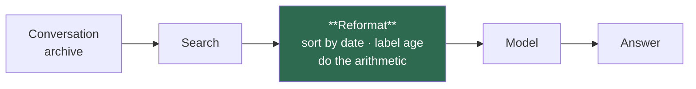

# llm-memory-conditioning

**Retrieval already worked. The answer is still wrong.**

*Companion to [memllm](https://github.com/i-shantt/memllm), which measured what
LLM memory costs. Read that one first for the cost story; this one is the system.*

---

## In one minute

AI assistants forget. The standard fix is **retrieval**: store the conversation,
and when a question arrives, search the archive and paste the relevant parts into
the prompt. Nearly all research effort goes into that search step — *did we find
the right piece?*

I measured it. The search is essentially solved: on the standard benchmark the
right piece is retrieved almost every time. **The model then answers wrong
anyway — on 41 of 91 test questions the answer was already in front of it.**

Asked *"What BBQ sauce am I currently obsessed with?"*, a model answered **Sweet
Baby Ray's**. Both the old preference and the new one were in its prompt. It
quoted the outdated one.

It's a research assistant who finds exactly the right email, then hands it to you
in a shuffled stack of forty pages with the dates torn off. The finding worked.
You still can't answer the question.

**This repo reformats what the search found, before the model reads it** —
sorting by date, labelling how long ago each thing happened, doing the date
arithmetic in advance. It is pure code: **no AI calls, no training, no extra
cost**, running only when a question is actually asked. Competing approaches run
an expensive AI pass over your whole history to maintain it.



**What happened.** On small Qwen models it worked: **+13 percentage points**
(p = 0.002), enough that a 1.5B model matched a 7B one without it. **On Gemma2
and Llama3.2 it vanished** — and the interesting part is that the mechanism is
identified precisely enough to say why. Sorting by date wins the questions where
"what's most recent?" is the answer and loses the ones where the search engine
had already ranked the answer first. On Qwen that trade pays; elsewhere it
cancels.

The feature the project was built around — explicitly tagging facts `OUTDATED` —
**never worked on any model**, despite the tags being correct 96% of the time.
The models ignored them.

**Everything below is the evidence for those four paragraphs**, including four
documented cases where I was wrong. Jump to
[Results](#results) · [Why it does not transfer](#it-does-not-transfer) ·
[Honest limits](#honest-limits).

---

## The finding in detail

Joining per-question retrieval hits against per-question correctness across
[memllm](https://github.com/i-shantt/memllm)'s stored runs (Qwen2.5-7B, hybrid
retrieval, k=10, n=100):

| question type | evidence retrieved, answer **wrong** | accuracy given evidence present |
|---|---|---|
| knowledge-update | 8 / 16 | 0.500 |
| temporal-reasoning | 13 / 21 | 0.381 |
| multi-session | 15 / 22 | 0.318 |
| single-session-assistant | 3 / 10 | 0.700 |
| single-session-user | 2 / 12 | 0.833 |

Hybrid retrieval scores `any_hit@10 = 1.000` on the `knowledge-update` slice —
the evidence is in the prompt every single time — and a 7B model still gets 8 of
those 16 wrong. **Recall is not the binding constraint.** What the model does
with the retrieved text is.

Formally, this repo is a **read-time context conditioner**: a deterministic
transform applied to the k retrieved units after retrieval and before prompt
assembly. No LLM calls, no model, no training, no write-time work. It is a
layer, not a competitor — it sits on top of any retriever or memory system.

## What is and is not new here

The phenomenon is **not** a discovery. STALE (arXiv 2605.06527) names it the
*current-state adjudication gap*; the Always-On Agents survey (2606.30306)
repeats it. Both are worth reading first.

What is missing from that literature is the **cost of the fix**. STALE's own
remedy, CUPMem, takes a backbone from 8.7% to 68.0% using an LLM adjudicator on
**every write** — O(corpus) LLM calls — and reports no cost analysis and no
control arms. TISER, TimeRefine and TG-LLM all answer with test-time reasoning
or fine-tuning. Nobody has published the deterministic, zero-LLM, read-time
version, and nobody prices theirs.

That gap is the point. Write-time consolidation pays LLM calls proportional to
the corpus whether or not a query ever arrives. Conditioning pays nothing, ever,
and touches only the k units a query actually retrieved.

## The conditioners

| name | what it does | targets |
|---|---|---|
| `identity` | the baseline — memllm's current rendering, byte for byte | control |
| `supersede:mark` | groups retrieved units that assert conflicting values for the same query term, labels the newest date `LATEST` and earlier ones `OUTDATED` | knowledge-update |
| `supersede:order` | states the ordering within a topic, claims nothing about currency | safe variant |
| `supersede:drop` | deletes the superseded units | the case *against* deletion |
| `temporal` | sorts chronologically, labels each unit with days/weeks/months before the question date | temporal-reasoning |
| `safe` / `all` | compositions | — |

`temporal` exists because the models demonstrably mishandle dated context, in
two separate ways. From memllm's `oracle` arm, where every evidence turn is in
the prompt by construction:

```
1.5B  "How many months have passed since I last visited a museum with a friend?"
      gold 5, said "One month" -- one month back is the February visit, which
      was with a parent; the visit with a friend is the October one, five back

14B   "How many weeks passed between ... the Farmers' Market ... ?"   gold 3
      "The last time you sold homemade baked goods was on 2023/02/26, and you
       participated in the Spring Fling Market on 2023/03/21. There are 4 weeks
       between these two dates."
```

The second is the cleaner failure: both evidence dates are quoted correctly off
the page and the subtraction over them is still wrong, on the largest model
tested. The first is the more common one — ten undifferentiated dated units, and
the model computes from whichever one it latched onto.

Sorting addresses the first, and pre-computed distances address the second.
Subtraction is free and exact in Python; doing it at render time turns "compare
two dates" into "read a number".

## The CPU gate

`scripts/run_mechanical_gate.py` scores a conditioner's *decisions* against
LongMemEval's own `has_answer` labels — no model, no GPU, no quota. It exists so
a broken rule is caught before anyone buys GPU time. It caught two real bugs.
It also certified a conditioner that turned out to do nothing at all, which is
its limit — see [the annotation nobody read](#the-annotation-nobody-read).

All 500 LongMemEval questions, BM25 at k=10:

```
knowledge-update (n=78) — the slice supersession is for
conditioner             fired   HARM   PREC    n  older   surv   tok Δ  llm
supersede:mark:naive    0.974  0.079  0.921   63  1.000  1.000   +7.0%    0
supersede:mark          0.538  0.036  0.964   28  1.000  1.000   +2.5%    0
supersede:drop          0.538  0.000  1.000   27     --  0.781  -23.7%    0
temporal                0.000     --     --    0     --  1.000   +7.6%    0

all question types (n=500)
supersede:mark:naive    0.746  0.312  0.688  240  0.956  1.000   +4.4%    0
supersede:mark          0.278  0.209  0.791   67  0.982  1.000   +1.1%    0
supersede:drop          0.278  0.000  1.000   53  0.000  0.883  -11.1%    0
temporal                0.000     --     --    0     --  1.000   +5.9%    0
```

- **HARM** — the newest evidence unit marked `OUTDATED`, i.e. the rule telling
  the model the current answer is stale. Want ~0.
- **PREC** — the newest evidence unit marked `LATEST`. Want high.
- **surv** — evidence units not dropped. Must be 1.000 for any `mark` mode.

The rule is accurate exactly where the phenomenon it models exists, and noisy
elsewhere: on knowledge-update it marks the right unit current 92–96% of the
time, while across all question types precision drops to 0.69–0.79 because it
fires where there is no supersession to find.

`supersede:drop` deletes **22% of all evidence** on knowledge-update. That is the
concrete argument against write-time deletion, which is what Mem0's UPDATE and
DELETE operations do irreversibly — measured rather than asserted.

### The gate earned its keep twice

Both of these looked like the idea failing, and both were bugs:

**Slot fragmentation.** Units were keyed on the *rarest* query term they
contained, on the theory that a specific word identifies the units in contention
better than a generic one. It does the opposite. For "What time do I usually go
to the gym?", `I go to the gym at 7pm` keys on "gym" while `I've moved my gym
time to 6pm` keys on "time" — so the two mentions that actually conflict landed
in different slots and neither was annotated. Grouping needs the *shared* term.

**Same-date siblings.** Ordering inside a slot broke ties by turn index, so an
assistant's follow-up outranked the user turn that stated the fact. The gate
reported the newest evidence unit marked `OUTDATED` on **93%** of
knowledge-update questions. Supersession is a claim about dates; same-day
siblings supersede nothing. Fixing it moved HARM from 0.933 to 0.079.

A third correction was to the gate itself. Its first harm metric counted *any*
evidence unit marked `OUTDATED` and reported 0.681, which looked disqualifying.
It was wrong: 67 of 78 knowledge-update questions carry **two** evidence turns on
two dates — the superseded fact and its replacement — because answering needs
both. Marking the earlier one `OUTDATED` is correct, and the metric was
penalising it.

## Results

Qwen2.5, Gemma2 and Llama3.2 via Ollama, BM25 at k=10, n=100,
`max_new_tokens=256`, deterministic grading. Each conditioner is paired against
that model's own `identity` arm on the same 91 graded question ids — same
retriever, same k, same model, same seed, same prompt template. Exact McNemar on
discordant pairs, paired bootstrap CI.

| model | baseline | `all` Δ | `temporal` Δ |
|---|---|---|---|
| Qwen2.5 1.5B | 0.2747 | **+0.1319** (p=0.002) | **+0.1099** (p=0.006) |
| Qwen2.5 3B | 0.3077 | +0.0879 (p=0.057) | +0.0549 (p=0.302) |
| Qwen2.5 7B | 0.4176 | +0.0440 (p=0.424) | +0.0110 (p=1.000) |
| Gemma2 2B | 0.3297 | −0.0110 (p=1.000) | +0.0110 (p=1.000) |
| Llama3.2 3B | 0.4286 | −0.0549 (p=0.180) | −0.0659 (p=0.109) |

`temporal:norank` — the same annotation with chronological re-sorting switched
off — was also run on the two non-Qwen models: Gemma2 −0.0110, Llama3.2 +0.0110.
Both null, and [why that matters](#what-survives-the-sort-is-the-active-ingredient)
is the most useful result here.

Read the bottom two rows first.

## It does not transfer

Within Qwen2.5 the effect is large at 1.5B and decays cleanly with model size —
12, 8, then 4 net questions fixed out of 91. That looked like a capacity story:
the transforms do arithmetic and ordering a small model cannot do for itself.

**On Gemma2 2B and Llama3.2 3B, it is gone.** Gemma is a null. Llama trends
*negative* on both arms, and `temporal` alone at −0.0659 (p = 0.109) is closer to
a real regression than to nothing.

So the honest claim is narrower than the Qwen gradient suggests: **this is a
Qwen2.5 result, not a small-model result.** A dose-response curve inside one
family is not evidence about models in general, and running two other families is
what turned that from an assumption into a finding.

### What survives: the sort is the active ingredient

The per-type breakdown is more informative than the totals, because the
conditioner does two things at once — it annotates each unit with its age, and it
re-sorts the units chronologically instead of by retrieval rank.
`temporal:norank` runs the annotation with the sort switched off, which separates
them.

| Δ by question type | n | Gemma `temporal` | Gemma `norank` | Llama `temporal` | Llama `norank` |
|---|---|---|---|---|---|
| knowledge-update | 16 | **+0.188** | **−0.125** | **+0.062** | +0.000 |
| single-session-user | 14 | **−0.143** | **+0.071** | **−0.214** | +0.000 |
| temporal-reasoning | 25 | −0.080 | −0.040 | −0.040 | +0.040 |
| multi-session | 26 | +0.000 | +0.038 | −0.077 | +0.000 |
| single-session-assistant | 10 | +0.200 | +0.000 | −0.100 | +0.000 |

Look at the top two rows. Toggling the sort flips the sign on both, in both
models, in opposite directions:

- **With the sort**, `knowledge-update` gains and `single-session-user` loses.
- **Without it**, `knowledge-update` loses and `single-session-user` recovers.

That is one mechanism, not two. **The chronological sort trades away the
questions where retrieval rank is the answer, to win the questions where recency
is the answer.** `single-session-user` is a single turn that BM25 ranks first —
re-ordering buries it. `knowledge-update` is a fact that was later revised —
ordering by date is precisely what surfaces the revision.

On Qwen2.5 that trade is favourable and the net is positive. On Gemma2 and
Llama3.2 the two effects cancel, which is why both models sit at a null overall
however the conditioner is configured.

The original hypothesis — annotation good, sort bad — was **wrong in an
instructive way**. The sort is not a bug to be removed. It is the active
ingredient, and it is doing exactly what it was designed to do; it is simply also
doing damage elsewhere that nobody was measuring.

**Take the per-type numbers with the caution they deserve.** These slices are
n=14 and n=16, so one question is ±0.07. No individual cell is significant. What
carries weight is that four independent sign flips all landed where the mechanism
predicted, not the size of any one of them.

### The obvious next thing, and why it was not built

If the sort helps recency questions and hurts rank questions, then sorting
*conditionally* — only when the question asks about a current state — should
capture the gain without the loss. Cheap, deterministic, and the natural next
move.

It does not survive contact with the data. `scripts/test_sort_router.py` tests
the premise against every banked arm, with no GPU, because every arm stores its
predictions and "would a router have helped?" is answerable offline.

The premise dies twice.

**The question types do not split on tense.** `knowledge-update` frequently asks
for the *superseded* value — "What was my **previous** personal best time?", "my
**former** manager Rachel", "the **earlier** fishing trip". Meanwhile
`single-session-user` contains "What book am I **currently** reading?". The
markers cut across the types instead of separating them.

**And the buckets carry no signal.** Grouping all 500 questions by tense marker
and measuring the sort's effect inside each:

| bucket | n (pooled) | `identity` | `temporal` | Δ |
|---|---|---|---|---|
| CURRENT | 40 | 0.500 | 0.550 | +0.050 |
| PAST | 65 | 0.523 | 0.600 | **+0.077** |
| NEITHER | 345 | 0.307 | 0.319 | +0.012 |

The largest gain is in PAST, which is backwards from the hypothesis. Per model
the CURRENT bucket is **n=8** — one question is 0.125 — and four of the five
models show exactly 0.000 there. A router built on this would be fitting noise.

So it was not built. The script is committed so the next person can see the
negative result rather than re-deriving it on GPU.

### Every arm reproduces exactly

Re-running the two `identity` baselines in a fresh Kaggle session, on different
allocated hardware, gave **100/100 byte-identical predictions** on both models.
Generation is greedy (`temperature: 0.0`), and it holds in practice and not just
in principle. Every paired comparison in this repo therefore compares runs that
differ only in the thing under test.

### The annotation nobody read

`supersede:mark` did **nothing**: −0.0110 at both 1.5B and 7B.

This is the part worth dwelling on, because it is where the CPU gate failed. The
gate certified this conditioner: on knowledge-update it marked the newest
evidence unit `LATEST` **96.4%** of the time and mislabelled it 3.6%. The
annotations were right. The model ignored them.

The gate measured whether the labels were *correct*. It could not measure whether
they were *used*, and those turned out to be different questions. Any
mechanical-correctness harness has this blind spot, and no amount of raising the
precision bar would have caught it.

Worse for the original hypothesis: the knowledge-update gain that supersession
was designed for was delivered by `temporal` instead — **+0.250 at 1.5B**,
against `supersede:mark`'s +0.000 on the same slice.

| Δ by question type, 1.5B | `temporal` | `supersede:mark` | `all` |
|---|---|---|---|
| knowledge-update | **+0.250** | +0.000 | **+0.250** |
| temporal-reasoning | +0.120 | +0.000 | +0.200 |
| multi-session | +0.077 | +0.038 | +0.077 |
| single-session-assistant | +0.100 | −0.100 | +0.100 |
| single-session-user | +0.000 | −0.071 | +0.000 |

`temporal` makes no claim about currency at all. It sorts chronologically and
labels each unit with its age. That is apparently enough: **the model does not
need to be told which fact is current, it needs the chronology made legible
enough to work it out.** Being told directly, in a label with 96% precision,
changed nothing.

### A correction found by reading the flips

The first version of these numbers had `temporal` at +0.1209. Checking *which*
twelve questions it fixed turned one up that was not a conditioning effect at
all: both arms refused an abstention question, but `identity` wrote "the
excerpts provided **do** not contain information" and the grader's refusal
patterns only matched "**does** not contain". One arm's refusal was detected and
the other's was not, which is a fake +1.

Fixed in memllm and re-graded through `scripts/regrade.py --pattern 'cond_*.json'`,
which is why the numbers above are slightly smaller than a first reading would
have given. Aggregate accuracy would never have shown this. Reading the individual
flips did.

### Deletion

`supersede:drop` came out at −0.0110, not significant, for −8.3% read tokens. The
CPU gate showed it deleting 22% of all evidence on knowledge-update, so a sharp
loss was the prediction; it merely failed to help. The honest reading is weaker
than "deletion is harmful": deletion bought nothing, while costing an
irreversible loss of information that a past-directed question would need.

### Cost

Every number above was produced with **zero LLM calls** and 1–7% more read
tokens. STALE's CUPMem reaches its numbers with an LLM adjudicator on every
write, which is O(corpus) calls paid whether or not a query arrives. This is the
comparison the literature does not report.

## Layout

```
memcond/conditioner/   base.py, supersede.py, temporal.py — the transforms
memcond/eval/          mechanical.py — the CPU gate's metrics
scripts/                run_mechanical_gate.py
tests/                  48 tests, no model, no network, no benchmark download
```

## Running it

Needs a [memllm](../memllm) checkout beside this one, or `MEMLLM_PATH` set. It
supplies the cost ledger, the audited grader and the lift statistics — reusing
them is deliberate, because a number from this repo is only worth something if
it is measured the way memllm's were.

```bash
python -m pytest tests/ -q
python scripts/run_mechanical_gate.py --limit 100 --retriever bm25
```

## Honest limits

- **Mechanical correctness does not imply usefulness, and the gate cannot tell
  the difference.** `supersede:mark` passed at 96.4% precision and moved accuracy
  by 0.000. Treat every gate number as necessary, never sufficient.
- **The headline result is family-specific.** Within Qwen2.5 the gradient is
  clean; on Gemma2 2B and Llama3.2 3B it disappears. Only Qwen 1.5B clears
  significance outright — 3B is suggestive with the two tests disagreeing at the
  margin, 7B is null, and both non-Qwen models are null-to-negative. Nothing here
  supports a claim about small models in general.
- **n=100 gives a CI of roughly ±0.08 per arm**, so no single model settles
  anything. The Qwen gradient and the consistent `knowledge-update` sign across
  five models are the load-bearing evidence; individual arms are not.
- **The sort/no-sort split is measured on two models and five question-type
  slices of n=10–26.** Four sign flips landing where the mechanism predicted is
  suggestive; none of the individual cells is significant, and the whole pattern
  rests on roughly a dozen questions changing hands.
- **The `temporal:norank` comparison was designed after seeing which type broke.**
  That is post-hoc, and post-hoc hypotheses find patterns in noise. It was
  pre-registered only in the weak sense that the flag already existed in the
  code before the transfer run.
- **The cross-model claim is the fragile one.** "1.5B conditioned matches 7B" is
  a comparison memllm explicitly warns against, because containment rewards
  length. It survives a token-F1 check, but token-F1 differences here are small
  in absolute terms (0.1821 vs 0.1759) and the arms were not designed for a
  cross-model test.
- **Away from knowledge-update the rule is noisy.** Across all 500 questions
  HARM is 0.209–0.312 — it fires where there is no supersession to find. Whether
  that costs accuracy is exactly what the GPU run is for, and it is the reason
  `supersede:order`, which claims no currency at all, exists as a fallback.
- **`fired` is not `n`.** `supersede:mark` fires on 53.8% of knowledge-update
  questions but annotates the *newest evidence unit* on 28 of 78, which is what
  HARM and PREC are rates over. The rest of the time it annotated other units.
- **Everything here uses BM25**, not a hybrid retriever. That started as a
  workaround -- sentence-transformers crashed on the Kaggle GPU with "no kernel
  image is available for execution on the device" -- but it is the better
  choice: BM25 also scores `any_hit@10 = 1.000` on knowledge-update, and the
  gate and the accuracy arms now describe the same retrieval rather than two
  different ones. Whether these conditioners behave the same over a dense
  retriever's distractors is untested.
- **`is_evidence` is LongMemEval's own labelling** and inherits whatever errors
  it contains.
- **Conditioning cannot fix a retrieval miss.** It only changes the presentation
  of what was already retrieved, so its ceiling is the 41-of-91 slice above.
