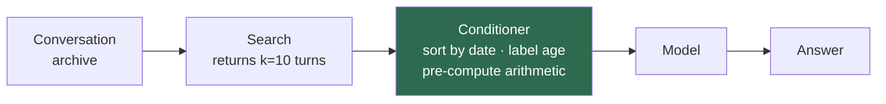

# llm-memory-conditioning

[](https://github.com/i-shantt/llm-memory-conditioning/actions/workflows/tests.yml)
[](LICENSE)

Research code and measurements for one question:

> When a search system has already put the right text into a language model's
> prompt, how much accuracy is still lost in *how that text is laid out* — and
> how much of it can be recovered with plain code, without another model call?

The code is a small Python library (`memcond`) that rewrites retrieved
conversation history before it reaches the model: it sorts the pieces into date
order, labels each one with how long ago it happened, and does the date
arithmetic in advance. The measurements are 23 full evaluation runs across five
open models, with every prediction saved in `results/`.

**The result is a null.** On the full benchmark the transform changes accuracy
by +0.7 points (p = 0.79). An earlier version of this README reported +13.2
points from a 100-question sample; re-running all 500 questions is what showed
that up, and [that failure is written up here](#the-headline-that-did-not-replicate)
rather than quietly corrected.

This is a research repo, not a package. Nothing here is on PyPI, and it depends
on a sibling checkout of [memllm](https://github.com/i-shantt/memllm) for its
grader and statistics.

## Summary of findings

**The premise holds.** Retrieval finds the right text and the model still
answers wrong: on **30 of 91** test questions *every* piece of evidence the
benchmark labels as necessary was in the prompt and the model got it wrong
anyway. There is real accuracy sitting in how the prompt is laid out.

**The transform does not capture it.** On the full 500-question benchmark,
rewriting the retrieved turns changes Qwen2.5-1.5B's accuracy by **+0.7 points
(p = 0.79)** — 30 questions fixed, 27 broken. That is the headline number and it
is a null.

**A 13-point result on a 100-question sample did not survive the full
benchmark.** This repo originally reported +13.2 points at n=91, p = 0.002.
Re-running all 500 questions reduced it to +0.7. The original measurement
reproduces exactly on those same 91 questions — the paired test was valid and the
code was right. The *sample* was unrepresentative: the seed-0 draw happened to
select questions where the baseline scored 0.275 against 0.409 on the rest of
the benchmark, and almost the whole gap was the baseline's bad luck. A paired
test controls for question difficulty within each pair; it cannot tell you your
sample of questions is unrepresentative of where the effect lives.
[What happened, in detail](#the-headline-that-did-not-replicate).

**The mechanism is real, measured at scale, and explains the null.** The
transform re-sorts retrieved turns into date order. That wins the question types
where recency is the answer and loses the ones where search rank already put the
answer first — and across a whole benchmark the two cancel:

| question type | n | Δ |
|---|---|---|
| knowledge-update | 76 | **+0.053** |
| temporal-reasoning | 124 | **+0.048** |
| multi-session | 126 | −0.032 |
| single-session-user | 70 | −0.043 |
| single-session-assistant | 50 | +0.000 |
| **overall** | **446** | **+0.007** |

This was predicted from n=14–16 slices before the full run, and it held at
n=70–126. It also explains the two "failed transfer" models more simply than
model family does: Gemma2 and Llama3.2 were showing the same cancellation all
along.

**Routing would not save it either.** An *oracle* router that applies the
transform only to the two types it helps — using the benchmark's own labels,
so not deployable — reaches +2.2 points (p = 0.12). That is the ceiling on this
idea, and it is not significant.

**The original idea did not work at all.** This project was built around
explicitly tagging superseded facts `OUTDATED`. Those tags are correct 96.4% of
the time and moved accuracy by **−1.1 points** (p = 1.000). The models ignored
them.

So: a negative result with an identified mechanism, a measured ceiling, and a
worked example of a significant finding dissolving under more data. Everything
below is the evidence. Jump to [Results](#results) ·
[The headline that did not replicate](#the-headline-that-did-not-replicate) ·
[Limits](#limits) · [Running it](#running-it).

---

## Background

Skip this if you already work on LLM memory. Everything after it assumes the
terms defined here.

### The problem being solved in the first place

A chat assistant has no memory between sessions. The standard fix is
**retrieval**: store past conversations, and when a new question arrives, search
that store and paste the most relevant pieces into the prompt. Almost all
research attention goes to the search step — *did we find the right piece?*

This repo is about the step immediately after: the retrieved pieces have to be
turned into prompt text, and that is normally a one-line f-string that nobody
measures.

### The benchmark

**LongMemEval** is the standard test for this. Each question comes with roughly
50 past chat sessions — about 490 conversation turns — and asks one thing whose
answer is somewhere inside them. There are 500 questions in six types:

| type | count | what it asks for |
|---|---|---|
| `multi-session` | 133 | evidence combined from more than one session |
| `temporal-reasoning` | 133 | dates compared, or a duration computed |
| `knowledge-update` | 78 | a fact the user later revised — sometimes the current value, sometimes the previous one |
| `single-session-user` | 70 | something the user said, in one session |
| `single-session-assistant` | 56 | something the assistant said, in one session |
| `single-session-preference` | 30 | a stated preference, applied to a new request |

30 of the 500 are **abstention** questions, where the correct response is to say
the information is not present.

### Vocabulary used throughout

| term | meaning in this repo |
|---|---|
| **unit** | one conversation turn — the thing retrieval returns and the thing a transform operates on |
| **retriever** | the search step. `BM25` is keyword search; `hybrid` is BM25 plus embedding similarity |
| **k** | how many units the retriever returns. Always 10 here |
| **evidence** | a unit that LongMemEval itself labels `has_answer` — it contains what is needed to answer |
| **conditioner** | the transform this repo adds, applied to the k retrieved units after retrieval and before the prompt is assembled |
| **`identity`** | the control conditioner. Renders units exactly as memllm already does, byte for byte. Every other run is compared against it |
| **arm** | one complete run: one model × one conditioner × a fixed question set, saved to `results/` with every prediction kept |
| **gold** | the benchmark's reference answer |
| **read tokens** | tokens spent answering one question, prompt plus completion. The cost measure used throughout |

### How the accuracy runs are set up

Most arms are a stratified 100-question sample of LongMemEval (seed 0), of which
**91 are gradable** — the other 9 have free-form reference answers with no
checkable surface form, and are excluded rather than counted wrong. Two arms
(Qwen2.5-1.5B `identity` and `all`) were re-run on all 500 questions, 446 of them
gradable. Grading is deterministic string matching from memllm, whose published
audit over 3,166 cases reports a false-accept rate of 0.0.

**The 100-question sample turned out to matter enormously**, which is the main
finding of the repo — see
[the headline that did not replicate](#the-headline-that-did-not-replicate).

A conditioner is always compared against the *same model's own* `identity` arm
over the *same question ids*: same retriever, same k, same model, same seed,
same prompt template. Arms run at different sample sizes are separate
experiments and are never paired against each other; `compare_conditioners.py`
enforces that on the ids rather than trusting the filenames. The only difference between the two runs is how the
retrieved units were written into the prompt. Significance is exact McNemar on
the questions where the two arms disagree, plus a paired bootstrap confidence
interval.

### Relationship to memllm

[memllm](https://github.com/i-shantt/memllm) is a companion repo that measured
what LLM memory *costs*. This repo imports its cost ledger, its audited grader
and its lift statistics, and compares against its stored baseline runs. That
reuse is deliberate: a number here is only worth something if it was produced
the same way memllm's were.

---

## The problem: retrieval succeeds and the answer is still wrong

Taking memllm's stored runs (Qwen2.5-7B, hybrid retrieval, k=10, 100 questions)
and joining per-question retrieval hits against per-question correctness — that
is, asking "when the evidence *was* retrieved, did the model get it right?"

There are two ways to ask that, and only one of them is fair. LongMemEval labels
every turn that is needed to answer a question, and some questions need several.
`any_hit@10` is satisfied when the retriever finds **one** of them, so a question
needing six evidence turns can score `any_hit = 1.0` while five sixths of the
answer is still missing. Getting that question wrong is not the model's fault.
`recall@10 = 1.0` is the honest condition: *every* labelled turn is in the
prompt, so nothing the model needs is absent.

| question type | wrong on `any_hit` | wrong on **full recall** | accuracy on full recall |
|---|---|---|---|
| knowledge-update | 8 / 16 | **6 / 13** | 0.538 |
| temporal-reasoning | 13 / 21 | **10 / 16** | 0.375 |
| multi-session | 15 / 22 | **9 / 16** | 0.438 |
| single-session-assistant | 3 / 10 | **3 / 10** | 0.700 |
| single-session-user | 2 / 12 | **2 / 12** | 0.833 |
| **all** | **41 / 81** | **30 / 67** | **0.552** |

The gap between the two columns is real and it is exactly the objection above:
11 of the 41 apparent failures had only part of their evidence retrieved, and
most of those are `multi-session`, the type that needs the most turns. Those are
retrieval failures wearing a reasoning failure's clothes.

**What survives the correction is still the point.** On 30 of 91 questions the
prompt contained every turn the benchmark says is needed and the model answered
wrong anyway — 45% of the questions it was fully equipped to answer. The two
single-session types, which need one turn and therefore cannot be short of
evidence, are unaffected by the correction at all.

**Search is not the binding constraint on this slice.** What the model does with
the text it was given is.

A concrete case, from those stored predictions:

```
Q     What brand of BBQ sauce am I currently obsessed with?
gold  Kansas City Masterpiece
pred  You are currently obsessed with Sweet Baby Ray's BBQ sauce.
```

Both the old preference and the newer one were in the prompt, and the model
quoted the outdated one — accurately, word for word. Each excerpt does carry its
date, but they arrive in search-relevance order, with nothing saying which is
most recent or how far back any of them is. Working that out is left to the
model, and here it did not.

In the vocabulary above, what this repo adds is a **read-time conditioner**: a
deterministic transform over the k retrieved units, run after retrieval and
before prompt assembly. No model call, no training, no work at write time. It is
a layer on top of a retriever, not a replacement for one.



## How this compares to published work

The phenomenon is **not** a discovery of mine. STALE (arXiv 2605.06527) names it
the *current-state adjudication gap*; the Always-On Agents survey (2606.30306)
repeats it. Both are worth reading first.

What is missing from that literature is the **cost of the fix**. STALE's own
remedy, CUPMem, takes a backbone from 8.7% to 68.0% by running an LLM
adjudicator on **every write** — a number of LLM calls proportional to the size
of the corpus — and reports no cost analysis and no control arms. TISER,
TimeRefine and TG-LLM all answer with test-time reasoning or fine-tuning. As far
as I can find, nobody has published the deterministic, zero-LLM, read-time
version, and nobody prices their own fix.

That gap is the reason this repo exists. Write-time consolidation pays LLM calls
proportional to the corpus whether or not anyone ever asks a question.
Conditioning pays no LLM calls at all, and touches only the k units that one
query actually retrieved. The price it does pay is 1–7% more read tokens, which
is reported in [Cost](#cost).

## The conditioners

| name | what it does | aimed at |
|---|---|---|
| `identity` | the control — memllm's existing rendering, byte for byte | — |
| `supersede:mark` | finds retrieved units that assert conflicting values for the same query term, then labels the one on the newest date `LATEST` and the earlier ones `OUTDATED` | knowledge-update |
| `supersede:order` | states the ordering within a topic but claims nothing about which value is current | a safer variant of `mark` |
| `supersede:drop` | deletes the superseded units outright | built to make the case *against* deletion |
| `supersede:mark:naive` | `mark` without the requirement that the units actually disagree; measured to show why that requirement is needed | — |
| `temporal` | sorts units into date order and labels each with how many days / weeks / months before the question it happened | temporal-reasoning |
| `temporal:norank` | the same labels with the sorting turned off — the control that separates the two halves | — |
| `all` | `supersede:mark` + `temporal` | — |
| `safe` | `supersede:order` + `temporal` | — |

### What that actually looks like

Three retrieved turns, for the question *"What time do I usually go to the
gym?"* asked on 2023/06/01. This is the real output of `memcond`, and the exact
text the model sees.

`identity` — memllm's existing rendering, and the control every arm is measured
against:

```
[2023/01/10 (Tue) 18:00] I go to the gym at 7:00 pm on weekdays.

[2023/02/02 (Thu) 10:00] Here are some tips for staying motivated.

[2023/05/03 (Wed) 20:00] I've moved my gym time to 6:00 pm.
```

`all` — reordered by date, each turn labelled with its position and its distance
from today, and the superseded gym time marked:

```
[2023/01/10 (Tue) 18:00 | OUTDATED mention of 'gym' -- superseded by 2023/05/03 (Wed) 20:00 | event 1 of 3 | 142 days / 20 weeks / 4 months before today] I go to the gym at 7:00 pm on weekdays.

[2023/02/02 (Thu) 10:00 | event 2 of 3 | 119 days / 17 weeks / 3 months before today] Here are some tips for staying motivated.

[2023/05/03 (Wed) 20:00 | LATEST mention of 'gym' (2 in total) | event 3 of 3 | 29 days / 4 weeks before today] I've moved my gym time to 6:00 pm.
```

(Those three lines are long; the block scrolls sideways rather than being
rewrapped, so what is shown is byte-for-byte what `memcond` emits.)

Same three turns, same words, nothing added from outside the archive. The date
always leads the prefix, exactly as `identity` writes it, so the two renderings
differ only by what was appended and by the ordering.

Every measurement in this repo is the difference between those two prompts.

### Why `temporal` exists

Models mishandle dated context in two distinct ways. Both examples below are
from memllm's `oracle` arm, where every evidence turn is in the prompt by
construction, so nothing is being blamed on retrieval:

```
1.5B  "How many months have passed since I last visited a museum with a friend?"
      gold 5, said "One month" -- one month back is the February visit, which
      was with a parent; the visit with a friend is the October one, five back

14B   "How many weeks passed between the time I sold homemade baked goods at
       the Farmers' Market for the last time and the time I participated in
       the Spring Fling Market?"                                  gold 3 weeks
      "The last time you sold homemade baked goods was on 2023/02/26, and you
       participated in the Spring Fling Market on 2023/03/21. There are 4 weeks
       between these two dates."
```

The first is **anchoring**: ten dated turns arrive in an order that says nothing
about time — evidence first and then filler in the `oracle` arm, search rank in
the real ones — and the model computes from whichever one it settled on. This is
the common case.

The second is **arithmetic**: both correct dates are quoted straight off the
page and the subtraction over them is still wrong. That is 14B, the largest
model memllm ran.

Sorting into date order addresses the first. Pre-computed distances address the
second — subtraction is free and exact in Python, and doing it at render time
turns "compare two dates" into "read a number".

## Checking the rules before spending any GPU

`scripts/run_mechanical_gate.py` scores a conditioner's *decisions* against
LongMemEval's own `has_answer` labels. No model, no GPU, no quota — it runs on a
laptop in seconds. The point is to catch a broken rule before buying GPU time.

Reading the table below:

| column | meaning |
|---|---|
| `fired` | fraction of questions where the rule annotated anything at all |
| `HARM` | the **newest** evidence unit was marked `OUTDATED` — the rule telling the model that the current answer is stale. Want ≈ 0 |
| `PREC` | the newest evidence unit was marked `LATEST` — the rule getting it right. Want high |
| `n` | questions where the rule annotated the newest evidence unit at all. `HARM` and `PREC` are rates over this, so a small `n` means a thin result |
| `older` | older evidence units marked `OUTDATED`. On knowledge-update these genuinely are superseded, so high is correct |
| `surv` | fraction of evidence units not deleted. Must be 1.000 for any `mark` mode |
| `tok Δ` | change in prompt tokens against `identity` |
| `llm` | LLM calls made. Zero by construction, and reported to prove it |

All 500 LongMemEval questions, BM25 at k=10:

```
knowledge-update (n=78) — the slice supersession is for
conditioner             fired   HARM   PREC    n  older   surv   tok Δ  llm
supersede:mark:naive    0.974  0.079  0.921   63  1.000  1.000   +7.0%    0
supersede:mark          0.538  0.036  0.964   28  1.000  1.000   +2.5%    0
supersede:drop          0.538  0.000  1.000   27     --  0.781  -23.7%    0
temporal                0.000     --     --    0     --  1.000   +7.6%    0

all question types (n=500)
supersede:mark:naive    0.746  0.312  0.688  240  0.956  1.000   +4.4%    0
supersede:mark          0.278  0.209  0.791   67  0.982  1.000   +1.1%    0
supersede:drop          0.278  0.000  1.000   53  0.000  0.883  -11.1%    0
temporal                0.000     --     --    0     --  1.000   +5.9%    0
```

`temporal` scores `--` because it never marks anything `LATEST` or `OUTDATED` —
it only sorts and labels ages, so there is no currency claim to be right or
wrong about.

The supersession rule is accurate exactly where the thing it models exists, and
noisy everywhere else: on knowledge-update it marks the right unit current
92–96% of the time, while across all question types precision falls to 0.69–0.79
because it fires where there is no supersession to find.

`supersede:drop` deletes **22% of all evidence** on knowledge-update (`surv`
0.781). That is the concrete argument against write-time deletion — which is
what Mem0's UPDATE and DELETE operations do irreversibly — measured rather than
asserted.

The gate has a real limit, and it is the most important thing on this page: it
certified a conditioner that turned out to do nothing at all. See
[the annotation nobody read](#the-annotation-nobody-read).

### Two bugs the gate caught

Both looked like the idea failing. Both were bugs in my code.

**Slot fragmentation.** Units were grouped by the *rarest* query term they
contained, on the theory that a specific word identifies the units in contention
better than a generic one. It does the opposite. For "What time do I usually go
to the gym?", `I go to the gym at 7pm` groups under "gym" while `I've moved my
gym time to 6pm` groups under "time" — so the two mentions that actually
conflict landed in different groups and neither was annotated. Grouping needs
the *shared* term.

**Same-date siblings.** Ordering inside a group broke ties by turn index, so an
assistant's follow-up outranked the user turn that stated the fact. The gate
reported the newest evidence unit marked `OUTDATED` on **93%** of
knowledge-update questions. Supersession is a claim about dates, and same-day
siblings supersede nothing. Fixing it moved HARM from 0.933 to 0.079.

A third correction was to the gate itself. Its first harm metric counted *any*
evidence unit marked `OUTDATED` and reported 0.681, which looked disqualifying.
The metric was wrong: 67 of the 78 knowledge-update questions carry **two**
evidence turns on two different dates — the superseded fact and its replacement
— because answering needs both. Marking the earlier one `OUTDATED` is correct
behaviour, and the metric was penalising it.

## Results

Qwen2.5, Gemma2 and Llama3.2 run locally through Ollama. BM25 at k=10,
`max_new_tokens=256`, deterministic grading, paired against each model's own
`identity` arm as described in [Background](#how-the-accuracy-runs-are-set-up).

**The full benchmark, all 500 questions (446 gradable).** This is the result the
repo stands on:

| model | `identity` baseline | `all` Δ | p |
|---|---|---|---|
| Qwen2.5 1.5B | 0.3834 | **+0.0067** | 0.791 |

**The 100-question sample, 91 gradable.** Every other model was run at this
scale, and the row above is the reason to read all of them as provisional:

| model | `identity` baseline | `all` Δ | `temporal` Δ |
|---|---|---|---|
| Qwen2.5 1.5B | 0.2747 | +0.1319 (p=0.002) | +0.1099 (p=0.006) |
| Qwen2.5 3B | 0.3077 | +0.0879 (p=0.057) | +0.0549 (p=0.302) |
| Qwen2.5 7B | 0.4176 | +0.0440 (p=0.424) | +0.0110 (p=1.000) |
| Gemma2 2B | 0.3297 | −0.0110 (p=1.000) | +0.0110 (p=1.000) |
| Llama3.2 3B | 0.4286 | −0.0549 (p=0.180) | −0.0659 (p=0.109) |

The 1.5B row here is the one that was re-run in full and did not hold. **Treat
the other four the same way**: they are 91-question estimates with a confidence
interval of roughly ±0.08, and the one that was checked at scale moved by 12
points. None of them has been replicated.

## The headline that did not replicate

The first version of this README led with **+13.2 points, p = 0.002** on
Qwen2.5-1.5B. Re-running the same two arms over all 500 LongMemEval questions
instead of a 100-question sample:

| question set | identity → `all` | Δ | fixed / broke | p |
|---|---|---|---|---|
| **all 446 gradable** | 0.3834 → 0.3901 | **+0.0067** | 30 / 27 | **0.791** |
| the original 91 | 0.2857 → 0.4066 | +0.1209 | 13 / 2 | 0.0074 |
| the 355 never sampled | 0.4085 → 0.3859 | −0.0225 | 17 / 25 | 0.280 |

**The original measurement was not a mistake.** Row two re-measures those same 91
questions inside the 500-question run and reproduces them: 0.4066 identical,
+12.1 points, p = 0.007. The arithmetic, the grader and the paired test were all
correct.

**The sample was unrepresentative, and specifically the baseline was.** On the
sampled 91 the `identity` arm scores 0.2857; on the other 355 it scores 0.4085.
The conditioned arm barely moves between the two (0.4066 against 0.3859). Nearly
the entire 12-point gap was the *baseline* having a bad draw, not the transform
having a good one.

**This is the failure mode a paired test cannot catch.** McNemar controls for
question difficulty *within* a pair — same question, same model, same retrieval,
one difference. What it cannot tell you is whether your sample of questions is
representative of the population where the effect lives. p = 0.002 was a correct
statement about 91 questions and a misleading one about the benchmark.

The practical lesson, which cost one GPU run to learn: **a significance test on a
subsample answers a smaller question than the one being asked.** With 100
questions and a ±0.08 interval, a 13-point effect is well inside the range that
sampling alone can manufacture.

## Why the effect cancels

The transform re-sorts retrieved turns into date order instead of leaving them in
search-rank order. That is a trade, not an improvement, and at n=446 the two
sides of it are visible:

| question type | n | identity | `all` | Δ |
|---|---|---|---|---|
| knowledge-update | 76 | 0.487 | 0.539 | **+0.053** |
| temporal-reasoning | 124 | 0.226 | 0.274 | **+0.048** |
| single-session-assistant | 50 | 0.580 | 0.580 | +0.000 |
| multi-session | 126 | 0.183 | 0.151 | −0.032 |
| single-session-user | 70 | 0.771 | 0.729 | −0.043 |

Grouped by what the mechanism predicts:

| | n | Δ | p |
|---|---|---|---|
| types the sort should help (`knowledge-update` + `temporal-reasoning`) | 200 | +0.050 | 0.121 |
| types the sort should hurt (everything else) | 246 | −0.029 | 0.210 |

`single-session-user` is a single turn that BM25 puts first — re-ordering buries
it. `knowledge-update` is a fact that was later revised — ordering by date is
exactly what surfaces the revision. Neither group reaches significance on its
own, but they point in the directions predicted, and their sum is the null.

**This prediction is older than the data that confirms it.** It was derived from
`temporal:norank` on n=14–16 slices of two models, and the README hedged that it
rested on about a dozen questions changing hands. At n=70–126 the same pattern
appears. That makes it the one claim here that got *stronger* with more data.

It also explains the two models that were written up as a failure to transfer.
Gemma2 2B and Llama3.2 3B were never a family-specific exception — they were
showing the cancellation at n=100 while Qwen happened to draw a sample that hid
it. One mechanism now covers every arm in the repo.

### Where that prediction came from

The section above confirms the trade at n=446. This is the smaller, earlier
experiment that predicted it — worth keeping because it was run first, and
because it is the reason the full-scale result was interpretable rather than
just disappointing.

The conditioner does two things at once: it labels each unit with its age, and
it re-sorts the units by date instead of by search rank. `temporal:norank` runs
the labelling with the sorting switched off, which separates the two.

| Δ by question type | n | Gemma `temporal` | Gemma `norank` | Llama `temporal` | Llama `norank` |
|---|---|---|---|---|---|
| knowledge-update | 16 | **+0.188** | **−0.125** | **+0.062** | +0.000 |
| single-session-user | 14 | **−0.143** | **+0.071** | **−0.214** | +0.000 |
| temporal-reasoning | 25 | −0.080 | −0.040 | −0.040 | +0.040 |
| multi-session | 26 | +0.000 | +0.038 | −0.077 | +0.000 |
| single-session-assistant | 10 | +0.200 | +0.000 | −0.100 | +0.000 |

Look at the top two rows. Turning the sort off flips the sign of both, in both
models, in opposite directions:

- **With the sort:** `knowledge-update` gains, `single-session-user` loses.
- **Without it:** `knowledge-update` loses, `single-session-user` recovers.

That is one mechanism, not two. **The date sort trades away the questions where
search rank was already the answer, in order to win the questions where recency
is the answer.** `single-session-user` is a single turn that BM25 puts first —
re-ordering buries it. `knowledge-update` is a fact that was later revised —
ordering by date is exactly what surfaces the revision.

My original hypothesis — labelling good, sorting bad — was **wrong, and
usefully so**. The sort is not a defect to be removed. It is the active
ingredient, doing exactly what it was designed to do, while also doing damage
elsewhere that nobody was measuring.

**These per-type numbers deserved caution when they were written.** The slices
are n=14 and n=16, so one question is worth ±0.07 and no individual cell is
significant. The README's claim at the time was only that four independent sign
flips landed where the mechanism predicts.

That was the right amount of confidence. The [full-scale
run](#why-the-effect-cancels) later reproduced the same pattern on n=70–126,
which is the strongest thing in this repo: a mechanism proposed on thin slices,
stated tentatively, and confirmed at five times the data. It just happens to
predict a null rather than a win.

### The obvious next step, and why I did not build it

If the sort helps recency questions and hurts rank questions, then sorting
*conditionally* — only when the question is asking about a current state —
should capture the gain without the loss. Cheap, deterministic, and the natural
next move.

It does not survive contact with the data. `scripts/test_sort_router.py` tests
the premise against every arm already run, with no GPU, because every arm stores
its predictions and "would a router have helped?" is answerable from those.

The premise fails twice.

**The question types do not split on tense.** `knowledge-update` frequently asks
for the *superseded* value — "What was my **previous** personal best time?", "my
**former** manager Rachel", "the **earlier** fishing trip" — while
`single-session-user` contains "What book am I **currently** reading?". The tense
markers cut across the question types instead of separating them.

**And the buckets carry no signal.** Grouping all 500 questions by tense marker
and measuring the sort's effect within each:

| bucket | n (pooled over 5 models) | `identity` | `temporal` | Δ |
|---|---|---|---|---|
| CURRENT | 40 | 0.500 | 0.550 | +0.050 |
| PAST | 65 | 0.523 | 0.600 | **+0.077** |
| NEITHER | 345 | 0.307 | 0.319 | +0.012 |

The largest gain is in PAST, which is backwards from the hypothesis. Per model
the CURRENT bucket is only **n=8** — one question is worth 0.125 — and four of
the five models show exactly 0.000 there. A router built on this would be
fitting noise.

So it was not built. The script is committed so that the next person can see the
negative result instead of re-deriving it on a GPU.

**And the full-scale run priced the whole idea.** A router does not have to work
off tense markers — suppose it could identify the question type perfectly. Apply
the transform only to `knowledge-update` and `temporal-reasoning`, using
LongMemEval's own labels, and route everything else to `identity`:

| policy | accuracy on 446 | Δ vs identity | p |
|---|---|---|---|
| `identity` everywhere | 0.3834 | — | — |
| `all` everywhere | 0.3901 | +0.0067 | 0.791 |
| **oracle type-routed** | **0.4058** | **+0.0224** | 0.121 |

That is an upper bound, not a system: it reads the answer key to decide how to
format the prompt. Even so it lands at +2.2 points and does not reach
significance. **Perfect routing is worth about two points here.** A real router
would have to be free, accurate, and would still be chasing that ceiling — which
is the argument for stopping rather than for building one more layer.

### Does conditioning a small model buy a bigger one?

**Read this after [the replication failure](#the-headline-that-did-not-replicate).**
Everything in this section is computed on the 91-question sample, where the 1.5B
conditioned arm scores 0.4066. On the full benchmark that arm scores 0.3901
against a 0.3834 baseline, so the interesting comparison is against a 7B that was
never re-run at n=500. The section is kept because the *method* is the point —
this is how a cross-model claim should be checked — but the numbers in it inherit
the sampling problem above and should not be quoted on their own.

Conditioned 1.5B scores 0.4066. The unconditioned 7B baseline scores 0.4176.
The tempting sentence is "conditioning makes a 1.5B match a model 4.7× its
size", and memllm explicitly warns against writing it: the grader marks an
answer correct when the gold span appears anywhere in it, so a more verbose
model gets more chances, and 7B's median answer is 27 words against 1.5B's 16.

`scripts/cross_model_check.py` tests it two ways, offline, from the stored
predictions:

**Paired, not eyeballed.** Every arm answers the same 91 question ids, so exact
McNemar applies across models the same way it does within one.

| comparison | accuracy | Δ | discordant | p |
|---|---|---|---|---|
| conditioned 1.5B vs **unconditioned 7B** | 0.4066 vs 0.4176 | −0.0110 | 9 / 10 | **1.000** |
| conditioned 1.5B vs unconditioned 3B | 0.4066 vs 0.3077 | +0.0989 | 16 / 7 | 0.093 |

Against 7B the discordant pairs are 9 against 10 — as close to a coin flip as
91 questions can produce. The test cannot separate them.

**Length-controlled.** Re-grading the same stored answers, each truncated to its
first N words. An advantage that survives the cap is accuracy; one that
evaporates was verbosity.

| arm | median words | full | 40w | 25w | 15w | 8w |
|---|---|---|---|---|---|---|
| conditioned 1.5B | 16 | 0.407 | 0.407 | 0.363 | 0.330 | 0.209 |
| unconditioned 3B | 18 | 0.308 | 0.297 | 0.275 | 0.275 | 0.187 |
| unconditioned 7B | 27 | 0.418 | 0.407 | 0.374 | 0.352 | 0.231 |
| **gap to 7B** | | −0.011 | +0.000 | −0.011 | −0.022 | −0.022 |
| **gap to 3B** | | +0.099 | +0.110 | +0.088 | +0.055 | +0.022 |

**Against 7B the gap never exceeds two questions at any cap.** It does not open
up as truncation removes 7B's verbosity advantage, which is what would happen if
the tie were an artefact of answer length. So the defensible claim is: *a
conditioned 1.5B is not distinguishable from an unconditioned 7B on this
benchmark* — not that it beats one.

**Against 3B the lead is real but mostly length.** It holds its sign at every
cap, so it is not purely an artefact, but it decays from +0.099 to +0.022 as
answers are truncated. Roughly three quarters of that lead was verbosity. Quote
the capped number, not the headline one.

### The arms reproduce exactly

Re-running the two `identity` baselines in a fresh Kaggle session, on different
allocated hardware, produced **100/100 byte-identical predictions** on both
models. Generation is greedy (`temperature: 0.0`), and this confirms it holds in
practice and not only in principle. Every paired comparison here therefore
compares two runs that differ only in the thing under test.

The n=500 run gives a second, weaker check across a *different* configuration:
of the 100 questions it shares with the sampled run, 89 identity predictions and
88 `all` predictions came back byte-identical, and accuracy on the shared 91
moved by one question (0.2747 to 0.2857). Same prompts, same greedy decoding,
different batch composition — so a small amount of serving-level nondeterminism
survives, well below the effects being measured but not zero.

### The annotation nobody read

`supersede:mark` — the feature this project was built around — did **nothing**:
−0.0110 at both 1.5B and 7B.

This is where the CPU gate failed, which makes it the most instructive result
here. The gate certified this conditioner: on knowledge-update it marked the
newest evidence unit `LATEST` **96.4%** of the time and mislabelled it 3.6%. The
annotations were right. The models ignored them.

The gate measured whether the labels were *correct*. It could not measure
whether they were *used*, and those turned out to be different questions. Any
mechanical-correctness harness has this blind spot, and no amount of raising the
precision bar would have caught it.

Worse for the original hypothesis, the knowledge-update gain that supersession
was designed to deliver was delivered by `temporal` instead — **+0.250 at
1.5B**, against `supersede:mark`'s +0.000 on the same slice:

| Δ by question type, 1.5B | `temporal` | `supersede:mark` | `all` |
|---|---|---|---|
| knowledge-update | **+0.250** | +0.000 | **+0.250** |
| temporal-reasoning | +0.120 | +0.000 | +0.200 |
| multi-session | +0.077 | +0.038 | +0.077 |
| single-session-assistant | +0.100 | −0.100 | +0.100 |
| single-session-user | +0.000 | −0.071 | +0.000 |

`temporal` makes no claim about currency at all. It sorts by date and labels
each unit with its age. Being told directly, in a label that is right 96% of the
time, changed nothing.

The +0.250 in that table is a 91-question number and the section above explains
why those are unreliable. At n=446 the knowledge-update gain is **+0.053**, real
in direction and a fifth the size. What does survive the rescaling is the
comparison *between* the two conditioners on the same questions: the explicit
currency label contributed nothing at either scale, and whatever gain exists on
this slice comes from the ordering.

### A correction found by reading individual flips

The first version of these numbers had `temporal` at +0.1209. Checking *which*
twelve questions it fixed turned up one that was not a conditioning effect at
all: both arms refused an abstention question, but `identity` wrote "the
excerpts provided **do** not contain information" and the grader's refusal
patterns only matched "**does** not contain". One arm's refusal was detected and
the other's was not, which is a fake +1.

Fixed in memllm and re-graded with `scripts/regrade.py --pattern 'cond_*.json'`,
which is why the numbers above are slightly smaller than a first reading would
have given. Aggregate accuracy would never have shown this. Reading the
individual flips did.

### Deletion

`supersede:drop` came out at −0.0110, not significant, for 8.3% fewer read
tokens. The CPU gate showed it deleting 22% of all evidence on knowledge-update,
so a sharp loss was the prediction; it merely failed to help. The accurate
reading is weaker than "deletion is harmful": deletion bought nothing, while
costing an irreversible loss of information that a past-directed question would
need.

### Cost

Every number above was produced with **zero LLM calls** and **1–7% more read
tokens** — 1.0% for `supersede:mark`, 5.3–5.8% for `temporal`, 6.2–6.9% for
`all`. `supersede:drop` is the only one that saves tokens, at −8.3%, and it is
the one that does not work.

STALE's CUPMem reaches its numbers with an LLM adjudicator on every write, a
number of calls proportional to the corpus, paid whether or not a query ever
arrives. That comparison is the one the literature does not report.

## Layout

```
memcond/conditioner/   base.py, supersede.py, temporal.py — the transforms
memcond/eval/          mechanical.py — the CPU gate's metrics
scripts/               run_mechanical_gate.py  — the CPU gate
                       run_conditioned_eval.py — one GPU arm
                       compare_conditioners.py — paired stats against identity
                       replication_check.py    — why n=100 disagreed with n=500
                       cross_model_check.py    — is a conditioned 1.5B a 7B?
                       test_sort_router.py     — the router negative result
results/               every arm as JSON, per-question predictions included
kaggle/                the notebook cells the GPU arms were run from
tests/                 79 tests, no model and no network; the five that drive
                       the eval script end to end skip without the benchmark
.github/workflows/     CI: the suite, plus a check that the committed tables
                       still regenerate byte-identically
```

## Running it

Needs a [memllm](https://github.com/i-shantt/memllm) checkout beside this one,
or `MEMLLM_PATH` set. It supplies the cost ledger, the audited grader and the
lift statistics.

```bash
git clone https://github.com/i-shantt/memllm.git
git clone https://github.com/i-shantt/llm-memory-conditioning.git
cd llm-memory-conditioning

pip install -r requirements.txt   # four small packages: no torch, no GPU
python -m pytest tests/ -q        # 74 pass, 5 skip without the benchmark
```

**The analysis needs nothing beyond that.** Every table above except the
accuracy runs themselves comes back from the stored arms in seconds:

```bash
python scripts/compare_conditioners.py   # the Results table and the per-type splits
python scripts/replication_check.py      # the replication failure and the oracle ceiling
python scripts/cross_model_check.py      # the 1.5B-vs-7B tables, both checks
python scripts/test_sort_router.py       # the router negative result
```

`results/conditioner_comparison.json` regenerates byte-identically, and CI
re-checks that on every push.

**The CPU gate needs the benchmark**, which is a 265 MB download and is not
vendored here:

```bash
pip install huggingface_hub
python -c "from huggingface_hub import hf_hub_download; \
hf_hub_download('xiaowu0162/longmemeval', 'longmemeval_s', \
repo_type='dataset', local_dir='../memllm/data/raw')"

python scripts/run_mechanical_gate.py --limit 100 --retriever bm25
```

**Re-running the accuracy arms needs a GPU** on top of the benchmark, plus
memllm's own requirements and a local Ollama. `kaggle/` has the notebook cells
they were produced from.

## Limits

- **Mechanical correctness does not imply usefulness, and the gate cannot tell
  the difference.** `supersede:mark` passed at 96.4% precision and moved
  accuracy by −0.011. Treat every gate number as necessary, never sufficient.
- **Only one arm in this repo has been run on the whole benchmark, and it is a
  null.** Qwen2.5-1.5B `all` against `identity`, n=446, +0.007, p = 0.791. Every
  other number here comes from a 100-question sample, and the one time a sampled
  result was re-run at full scale it fell from +0.132 to +0.007. Read the rest of
  the tables as hypotheses that have not been tested at the size they would need
  to be.
- **100 questions gives a confidence interval of roughly ±0.08 per arm.** That is
  wide enough to manufacture a 13-point effect out of nothing, which is exactly
  what happened. This is the single most important caveat on the page.
- **Neither half of the mechanism is significant on its own at full scale.** The
  types the sort should help gain +0.050 (n=200, p = 0.121) and the types it
  should hurt lose −0.029 (n=246, p = 0.210). The pattern matches the prediction
  in both direction and relative size, but "matches a prediction" is not the same
  as "is distinguishable from zero", and neither group is.
- **The sort / no-sort split itself is measured on two models and five
  question-type slices of n=10–26.** No individual cell is significant. Its
  standing rests on the full-scale run reproducing its predicted directions, not
  on the split's own numbers.
- **The `temporal:norank` comparison was designed after seeing which question
  type broke.** That is post-hoc, and post-hoc hypotheses find patterns in
  noise. It was pre-registered only in the weak sense that the flag already
  existed in the code before the transfer run.
- **The cross-model comparison is the most fragile thing here**, and
  [it is checked two ways](#does-conditioning-a-small-model-buy-a-bigger-one)
  rather than asserted. It says conditioned 1.5B is *indistinguishable* from the
  7B baseline, which is a weaker statement than beating it — and it is computed
  on the 91-question sample, so it inherits everything above. The 7B arms were
  never re-run at n=500.
- **Away from knowledge-update the supersession rule is noisy.** Across all 500
  questions HARM is 0.209–0.312 — it fires where there is no supersession to
  find. That is why `supersede:order`, which claims no currency at all, exists
  as a fallback.
- **`fired` is not `n`.** `supersede:mark` fires on 53.8% of knowledge-update
  questions but annotates the *newest evidence unit* on 28 of 78, which is what
  HARM and PREC are rates over. The rest of the time it annotated other units.
- **Everything here uses BM25**, not a hybrid retriever. That started as a
  workaround — sentence-transformers crashed on the Kaggle GPU with "no kernel
  image is available for execution on the device" — but it is the better choice
  anyway: BM25 also scores `any_hit@10 = 1.000` on knowledge-update, so the
  evidence is equally present, and the gate and the accuracy arms now describe
  the same retrieval rather than two different ones. Whether these conditioners
  behave the same over a dense retriever's distractors is untested.
- **`is_evidence` is LongMemEval's own labelling** and inherits whatever errors
  it contains.
- **Conditioning cannot fix a retrieval miss.** It only changes the presentation
  of what was already retrieved, so its ceiling is the 30-of-91 full-recall
  slice above — and on the 11 partial-recall questions, no amount of
  reformatting can supply a turn the retriever never returned.

## License

[MIT](LICENSE). LongMemEval is a separate dataset under its own terms and is
not redistributed here.
